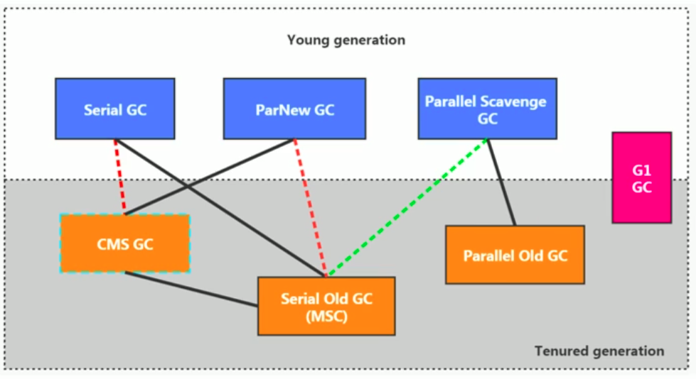

# ｀目录

[TOC]

# GC 分类与性能指标

## 分类

### 运行方式划分

- 并行垃圾回收器：一个CPU进行垃圾回收。默认被应用在client 模式的JVM中
- 串行垃圾回收器：多个CPU进行垃圾回收。

### 工作模式划分

- 并发式垃圾回收器：STW在垃圾回收时，暂停用户线程。
- 独占式垃圾回收器：垃圾回收器和用户线程交替执行。

### 碎片处理方式划分

- 压缩式垃圾回收器：垃圾回收完成（时）后，对内存碎片进行整理。
- 非压缩式垃圾回收器：不进行内存碎片整理操作。

### 按工作区间分

- 年轻代垃圾回收器：
- 老年代垃圾回收器：

## 性能指标

### 吞吐量

运行用户代码的时间占总运行时间(程序运行时间＋内存回收时间)的比例

### 垃圾收集开销

垃圾收集时间占总运行时间的比例

### 暂停时间

执行垃圾回收时，用户线程被暂停的时间

### 收集频率

相对于应用程序的执行，收集操作发生的频率

### 内存占用

占用的Java 堆区的内存大小

### 速度

一个对象从诞生到回收所经历的时间　

***评价标准：***

- 吞吐量、暂停时间和内存占用。往往是不可兼得的。
- **在可控的暂停时间下，增加吞吐量**

# 不同的垃圾回收器概述

## 垃圾回收器的组合关系

## 查看默认的垃圾回收器

- **-XX:+PrintCommandLineFlags** 查看命令行相关参数
- `jinfo -flag 相关的垃圾回收器参数　进程ID`

# Serial串行回收器

- HotSpot中Client模式中，默认的新生代垃圾回收器。**单线程**
- 采用**复制算法**，串行回收和"Stop The World"机制执行内存回收。
- Serial Old 收集器执行老年代的垃圾回收，使用**标记—压缩算法**，串行回收，和"Stop The World"机制
  - Client 模式下，默认的老年代垃圾回收器
  - Server模式下：
    - 与新生代的`Parallel Scavenge`配合使用
    - 作为老年代`CMS GC`的后备方案

## 优势

- 简单而高效，没有线程切换的开销。

## 应用场景

用户的桌面应用场景，可用内存不大(几十MB至一两百MB),垃圾回收不频繁发生

## HotSpot虚拟机设置方式

`-XX:UseSerialGC`可以指定新、老年代都使用串行收集器。

# ParNew并行回收器

并行的（多线程）的**新生代**垃圾回收器。并行版的Serial回收器。采用**复制算法**，并行回收和"Stop The World"机制执行内存回收。

老年代可以使用CMS 或者 serialOld　回收器。（Jdk 9后，CMS 停用，且可以搭配serialOld）

## HotSpot虚拟机设置方式

`-XX:UseParNewGC`可以指定新年代使用ParNew收集器。

`-XX:UseParellelGCThreads`设置并行线程数，默认和CPU核心数相同

# Parallel回收器：吞吐量优先

- Parallel Scavenge 新生代垃圾回收器：复制算法，并行执行，STW

- Parallel Old 老年代垃圾回收器: 标记－整理算法，并行执行,吞吐量优先
- **java8默认**

## 优势

自适应调节：动态调节自适应内存分配策略

## 应用场景

批量处理、订单处理、工资支付、科学计算等

## HotSpot虚拟机设置方式

+ `-XX:UseParallelGC`可以指定新生代使用Parallel GC

+ `-XX:UseParallelOldGC`可以指定老年代使用Parallel Old GC（这两个参数互相激活）

+ `-XX:UseParellelGCThreads`设置年轻代并行线程数，默认和CPU核心数相同。

+ `-XX:MaxGCPauseMillis`设置GC最大的STW时间。（单位是毫秒）

  通过调整heap大小和其他参数来实现

+ `-XX:GCTimeRatio`垃圾回收时间占总时间的比例 **N**。`1/(N+1)`（０－１００）默认是99,即１％

+ `-XX:+UseAdaptiveSizePolicy`自适应调节策略

# CMS回收器：低延迟

HotSpot虚拟机中第一款真正意义上的**并发**垃圾收集器，实现了垃圾收集线程和用户线程并发工作。(Concurrent-Mark-Sweep)

- 并发执行，**标记－清除算法**，减轻STW

## 运行过程

1. **初始标记**：会触发STW,将所有与`GC Roots`直接相连的对象标记。速度非常快，导致STW时间很短
2. **并发标记**：和用户线程并发执行，从直接相连的对象出发，遍历整个对象图。耗时长
3. **重新标记**：由于上一步的并发执行，此时可能对象的引用关系已经发生了变化（有些对象不是垃圾了）。因而，需要再次进行STW,对引用关系进行修正。速度也很快
4. **并发清除**：并发清除掉已被标记为死亡的对象

> **为何不能使用标记压缩算法？**
>
> 在并发清除阶段，若使用标记压缩的算法，会改变引用地址。而用户线程还在运行。

## 优点

- 低延迟
- 并发收集

## 缺点

- 会产生内存碎片。可能无法因为无法分配大对象，而不得补触发`Full GC`
- 对cpu资源敏感。因为占用了一部分线程导致，应用程序变慢
- 不能在内存紧张的时候，才回收。而是，必须存在一个**阈值**。由于并发标记阶段和并发清除阶段，用户线程未停止。因而，必须在垃圾回收时，保证用户线程有足够的空间可用。若内存不够，会引发`Concurrent Mode Failure`
- 无法处理**浮动垃圾**（并发标记阶段新产生的垃圾）。

## 应用场景

- 强交互应用

## HotSpot虚拟机设置方式

+ `-XX:UseConcMarkSweepGC`可以指定新生代使用ParNew GC,老年代使用CMS,(Serial Old 后备)

+ `-XX:CMSInitiatingOccupanyFraction`设置堆内存使用率的阈值，JDK5及以前使用68,之后为92。（老年代）。通过设置该阈值，可以有效降低`Full GC`次数

+ `-XX:UseParellelGCThreads`设置年轻代并行线程数，默认和CPU核心数相同。

+ `-XX:MaxGCPauseMillis`设置GC最大的STW时间。（单位是毫秒）

  通过调整heap大小和其他参数来实现

+ `-XX:GCTimeRatio`垃圾回收时间占总时间的比例 **N**。`1/(N+1)`（０－１００）默认是99,即１％

+ `-XX:+UseAdaptiveSizePolicy`自适应调节策略

# G1回收器：区域化分代式

　