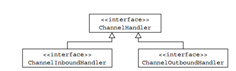
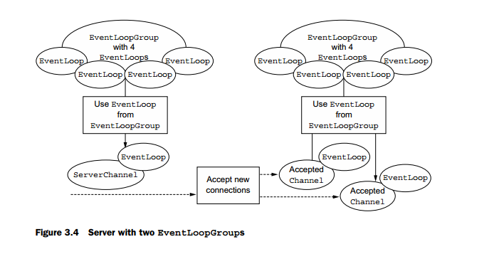

##	Netty 学习笔记

###	Chapter1

> all problems in computer science can be solved by another level of indirection.
>
> ​																										——David Wheeler

构建在 java NIO 之上，异步的事件驱动的，兼具性能和扩展性的网络框架。

#### Channel，EventLoop 和 ChannelFuture

* Channel——Sockets
* EventLoop——Control flow,multithreading,concurrency
* ChannelFuture——异步通知

##### Channel 接口

基本的 `I/O` 操作，（例如，bind(),connect(),read() 和write() ）依赖底层网络传输协议的实现。在 Java中，为 `class Socket`. Channel 是对其的进一步封装。Netty 中有以下几种对 Channel 的实现：

	1. EmbeddedChannel 
	2. LocalServerChannel
	3. NioDatagramChannel
	4. NioSctpChannel
	5. NioSocketChannel

##### EventLoop 接口

Netty  的对一个链接生命周期中事件处理的核心抽象。

Channels ,EventLoops,Threads, EventLoopGroups 之间的关系。

* 一个 EventLoopGroup 包含一个或多个 EventLoop
* 一个 EventLoop 绑定到一个 Thread 上
* 所有被 EventLoop 处理的 I/O 时间都交给相应 Thread
* 一个 Channel 注册在 一个EventLoop 中
* 一个 EventLoop 可以分配到一个或多个 Channel

***注意：***被某个Channel 处理的 IO 一定会被相同的线程执行，因而不需要同步。

##### ChannelFuture 接口

所有Netty 中的IO 操作都是异步的。ChannelFuture 接口能在操作返回后的另一段时间后，处理结果。其中的 addListener()可以 注册一个ChannelFutureListener。以便在操作完成后，执行对应的操作。

> 可以把ChannelFuture 想象为一个占位器，用来存放一个操作的结果。不能精确预知何时被执行，但一定被执行。

#### ChannelHandler 和 ChannelPipeline

管理数据流，执行应用处理逻辑的组件。

##### ChannelHandler 接口

ChannelHandler 接口中的方法被事件触发。像是一个容器，包括了所有处理输入输出数据的逻辑。例如，ChannelInboundHandler 便是一个子接口，可以接受输入事件和数据。

##### ChannelPipeline 接口

是一个容器，包含一个 ChannelHandler 链和传播输入输出时间流的API。

当一个 Channel 创建后，会自动分配一个自己的 ChannelPipeline。ChannelHandler 加入到ChannelPipeline 的流程如下：

	1. 使用 ServerBootStrap 注册一个ChannelInitializer 
	2. 调用 ChannelInitializer.initChannel() ，将一系列自定义 ChannelHandler加入到管线。
	3. ChannelInitializer 将自身从管线中移除

ChannelHandler 可以被理解称一个通用容器。可以保存处理任何通过管线事件和数据的代码。

ChannelHandler 在 ChannelPipeline 中的顺序取决与添加的顺序。图中显示 InboundHandler 和OutBoundHandler 可以同时被添加到一个 pipeline。如果读到一个消息或者其他inbound 事件，它将从pipeline 的 head 端开始，被传递到第一个ChannelInboundHandler   。处理后，将被传递到下一个ChannelInboundHandler.最终数据或消息到达pipeline 的末端，此时所有的处理都完成了。

Outbound数据是可写的，从pipeline的尾端流到头端。

可通过 ChannelHandlerContext(会被作为handler中处理函数的参数) 将事件转发到下一个Handler 。Netty 提供了抽象基类 ChannelInboundAdapter 和 ChannelOutboundAdapter。实现了简单的传递事件的方法。

虽然 InboundHandler 和 OutboundHandler 可以被混合存放在同一个pipeline 中，但是Netty会保证数据只在相同类型的handler中之间传递。

当一个ChannelHandler 被添加到 ChannelPipeline中的时候，会被分配一个ChannelHandlerContext ，代表两者之间的绑定。多用于写outbound data.

有两种方式可以发送消息。可以直接写入Channel ，这将使消息从Pipeline 的尾端开始传递。亦可以写入相应的CHannelHandlerContext 中，这将使消息从下一个Channelhandler开始传递。

#####  Encoder 和 Decoder

网络数据总是字节序列。所以，需要Encoder 和Decoder 来对字节序列进行编码和解码。 如：`ByteToMessageDecoder` 和`MessageToByteEncoder`,`ProtobufEncoder`和`ProtobufDecoder` .

严格来说，其他Handler 也可以做 Encoder/Decoder 的工作。但由于有adapter 类简化了Channel的创建过程。所以所有的Encoder/Decoder适配器类都实现了 ChannelInboundHander 或者ChannelOutboundHandler  。

##### 抽象类 SimpleChannelInboundHandler

当需要创建接受解码的消息的ChannelHandler时，可以继承`SimpleChannelInbound-Handler<T>`.其中T表示消息类型。然后，重写其中的方法。最重要的方式是`channelRead0(ChannelhandlerContext,T)`.

### Bootstrapping

提供设置应用网络层的容器，例如设置将进程绑定到端口（一般指服务端），连接进程到另一个在特定主机上特定端口运行的进程（一般指客户端）。

> 面向连接的协议：例如TCP

因此，有两种bootstrap:

* ServerBootstrap:绑定到本地端口 . 2个EventLoopGroups
* Bootstrap：连接到远程host和port. 1个EventLoopGroups

Server 端需要两个不同的`Channel`集合。其中一个包含一个代表服务端自己socket `ServerChannel` 。另一个包含所有处理进来连接的 Channel。一个Channel对应一个连接。

与ServerChannel相关联的EventLoopGroup会分配一个负责为到来连接创建Channel 的EventLoop。如果一个连接被允许， 则第二个EventLoopGroup 分配一个EventLoop 给对应的Channel。

