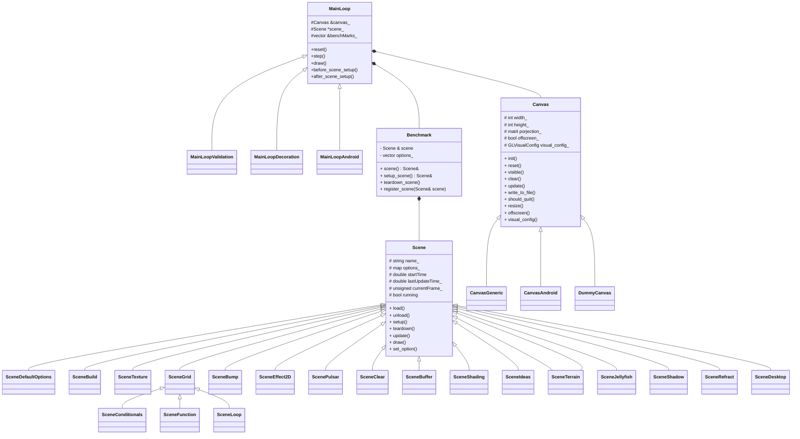
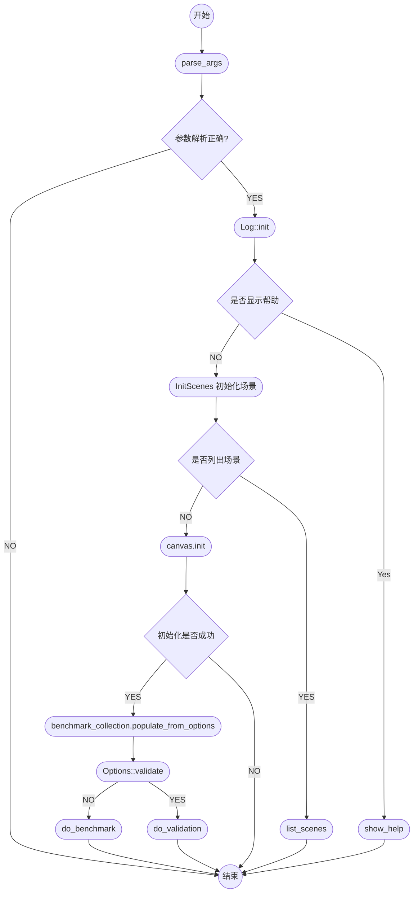
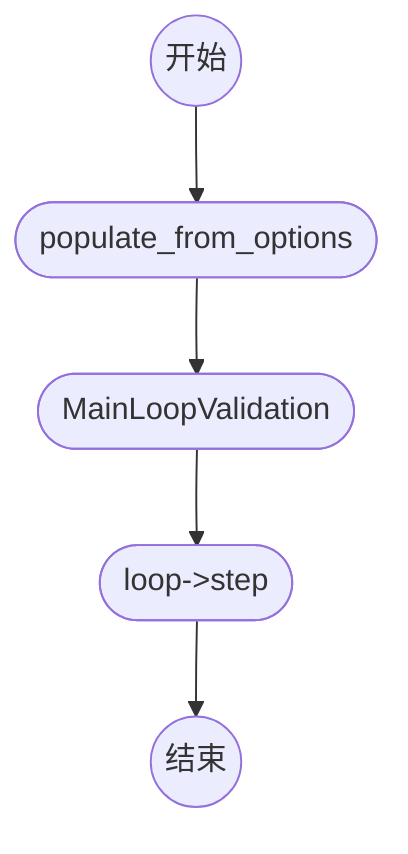
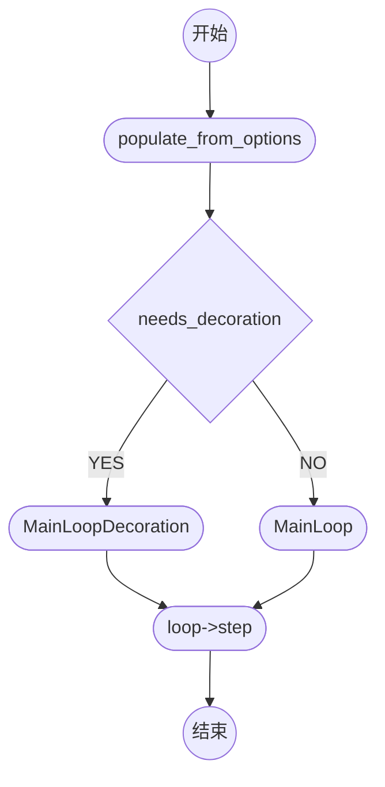
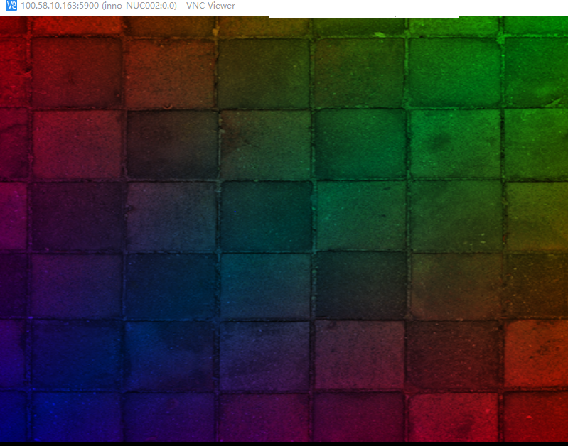

# glmark2 源码分析

## 构建方式

最新的 glmark2 已支持 meson 构建系统。可以使用 meson 构建相关特性X11，Wayland，DRM。dispmanx，win32,mir 还未被支持，要编译这些特性要使用 WAF 编译。 

### meson

```shell
#配置

$ meson setup build -Dflavors=drm-gl,drm-glesv2,wayland-gl,wayland-glesv2,x11-gl,x11-glesv2 [-Ddata-path=DATA_PATH --prefix=PREFIX]

#编译:

$ ninja -C build

#安装：

$ [DESTDIR=<destdir>] ninja -C build install

```

**注意：**

源代码根目录中的`meson_options.txt` 指定列 `Dflavors`可设置的值。

> 最新的构建方式信息详见 README 文件和 INSTALL 文件。

## 代码结构

- android 安卓编译相关
- data  shaders,textures,models 数据目录
- doc man手册
- fastlane/metadata/android/en-US 安卓编译相关
- src 源代码
- warlib war库目录 
- INSTALL*  安装说明
- README  简介
- meson.build/meson_options.txt  meson 编译设置文件
- waf/wscript WAF 编译配置文件

### src 目录结构

- zlib 依赖库
- glad glad2 依赖库
- libpng 依赖库
- libmatrix 实现的一个矩阵操作库
- libjpeg-turbo 依赖库
- include 头文件目录

- android.cpp Anroid平台的入口
- benchmark-collection.* benchmake的处理，程序运行的benchmark有不同的方式，可以来自文件（运行参数有这个选项）或配置选择。
- scene-default-options.cpp 对接benchmark中的scene，setup options
- benchmark.* benchmark类，用来处理scene的
- canvas-* 继承自Canvas类，按照Android和非Android分，做OpenGL绘制前的初始化。
- canvas.h Canvas类
- default-benchmarks.h 运行的bench，每个bench来自scene，有不同的配置。
- gl-headers.* OpenGL版本和扩展的判断 support 函数
- gl-state-* 不同窗口系统egl/glx/wgl的OpenGL初始化和配置封装
- gl-visual-config.* 计算和选择窗口的配置 GL visual
- main.cpp 入口函数
- main-loop.* 主循环
- mesh.* 将顶点和相关的属性封装成mesh类，处理范围包括：vbo和draw
- model.* 处理model目录下的模型文件，加载解析3ds和obj文件，转换顶点、计算法向量和纹理坐标
- native-state-* NativeState基类，根据不同的桌面窗口系统：dispmanx/drm/mir/wayland/win32/x11
- options.* 运行时参数的解析和管理
- scene.* 各个运行测试模块的管理
- scene-* 具体各个测试用例场景构建
- scene-clear.cpp scene的一个模板，可以在此基础上，进行自己scene的开发
- scene-collection.h 初始化管理所有的scene，将他们串起来
- shared-library.* SharedLibrary类，给窗口系统用，来加载和使用GL的库。在Android平台下使用，x11不用。
- text-renderer.* main-loop中绘制fps和title的纹理
- image-reader.* png/jpeg图片进行统一管理，抽象成ImageReader类
- texture.* 纹理贴图的封装，纹理数据读取来自ImageReader类
  

### 主要类关系





### benchmark的执行流程

分别是do_validation和do_benchmark，两个的整体流程一致：

1. 通过 benchmark_collection.populate_from_options() 加载具体测试项 benchmark；
2. 根据 Option 定义 Loop 类型，然后循环执行loop中的测试项：while (loop->step());
3. do_validation 只是验证下这个bench是不是可以执行，很快会结束，不统计得分
4. do_benchmark 是会按照配置参数完全执行bench，会计算得分

#### do_validation



#### do_benchmark



用例存储主要是 class MainLoop 中的 scene_ 和 benchmarks_ ，benchmarks_ 是 MainLoop::step() 中从 benchmarks_ 中取出scene给 scene_

```C
while (bench_iter_ != benchmarks_.end()) {
    scene_ = &(*bench_iter_)->scene();
    next_benchmark();
}
if (bench_iter_ != benchmarks_.end()) {
    before_scene_setup();
    scene_ = &(*bench_iter_)->setup_scene();
    after_scene_setup();
}
 if (scene_ ->running() && !should_quit)
        draw();
 if (!scene_->running() || should_quit) {
        if (scene_setup_status_ == SceneSetupStatusSuccess) {
            score_ += scene_->average_fps();
            benchmarks_run_++;
        }
        log_scene_result();
        (*bench_iter_)->teardown_scene();
        scene_ = 0;
        next_benchmark();
  }
```

```c++
//draw()
void
MainLoop::draw()
{
    canvas_.clear();

    scene_->draw();
    scene_->update();

    canvas_.update();
}

```

scene() 直接返回 Benchmark 中的 scene_
setup_scene() 给scene分佩 option ，option来自构造函数Benchmark::Benchmark(const string &s)，每个Benchmark是单独的一个测试项来自 benchmark-collection 的 benchmarks_，benchmarks_ 的每一项来自三个方面：

1. 通过运行命令中的参数“-b, --benchmark BENCH”获取option生成
2. 通过运行命中的的参数“-f, --benchmark-file F”读文件生成
3. 来自DefaultBenchmarks中的populate函数中定义的默认
   其主要还是获取固定格式的options列表
   load和setup就走到具体的scene中了。

```C
Scene &
Benchmark::setup_scene()
{
    scene_.reset_options();
    load_options();

    scene_.load();
    scene_.setup();
    
    return scene_;

}
```


## 测试模块

|   模块名   |
| :--------: |
|   buffer   |
|   build    |
| contionals |
|  desktop   |
|  effect2d  |
|  function  |
|   ideas    |
| jellyfish  |
|    loop    |

是按照 default-benchmarks.h 中定义的顺序执行，比运行glmark --scene-list 列出所有的测试项少一个clear。
所有的scene在scene-collection.h文件中通过 add_scenes 添加到 scenes_ 集合中，这里比上面的 --scene-list中多添加一个DefaultOptions，添加的每个scene都有一个对应的cpp文件scene-*.cpp，scene-grid.cpp为中间文件。

## 编写自定义测试场景

编写了一个可以显示纹理的测试场景 `SceneTriangle`

### 定义测试类`scene.h`

```c++
class SceneTriangle : public Scene
{
public:
    SceneTriangle(Canvas &pCanvas);
    bool load();
    void unload();
    bool setup();
    void teardown();
    void update();
    void draw();
    ValidationResult validate();

    ~SceneTriangle();

protected:
    Program program_;
    GLuint texture_;
	Mesh mesh_;
};

```

### 实现测试类`SceneTriangle.cpp`

#### 构造函数

```c++
SceneTriangle::SceneTriangle(Canvas &pCanvas) :
    Scene(pCanvas, "triangle")//指定场景名
{
   ......
    //将场景使用的纹理添加到textureMap
    //将纹理文件放到${date-path}/textures中。会自动检索
    Texture::find_textures();
   .....
   
}

```

#### load()函数

```C++
bool
SceneTriangle::load()
{
    running_ = false;
    return true;
}

```

#### unload()函数

```c++
void
SceneTriangle::unload()
{
    mesh_.reset();
}
```

#### setup()函数

```c++
bool
SceneTriangle::setup()
{
    if (!Scene::setup())//父类setup()
        return false;

    static const std::string vtx_shader_filename(Options::data_path + "/shaders/triangle-test.vert");//文件加载vetex shader
    static const std::string frg_shader_filename(Options::data_path + "/shaders/triangle-test.frag");//文件加载fragment shader
	Log::error("Triangle shader loaded \n");

    // Create texture according to selected filtering
    GLint min_filter = GL_NONE;
    GLint mag_filter = GL_NONE;
   
   	min_filter = GL_LINEAR;
    mag_filter = GL_LINEAR;
    
    //纹理名称，必须在textureMap 中
    const string& whichTexture("triangle-test");
    //纹理加载
    if (!Texture::load(whichTexture, &texture_, min_filter, mag_filter, 0)){
		Log::error("Triangle texture loaded failed\n");
        return false;
    }

    // Load shaders
    ShaderSource vtx_source;
    vtx_source.append_file(vtx_shader_filename);
    ShaderSource frg_source;
    frg_source.append_file(frg_shader_filename);
	//加载编译Program
    if (!Scene::load_shaders_from_strings(program_, vtx_source.str(),
                                          frg_source.str()))
    {
        return false;
    }

	//使用Porgram
    program_.start();

    /*
    设置顶点数据格式：position：3，color：3，texcoord：2
    */
	std::vector<int> format;
	format.push_back(3);
	format.push_back(3);
	format.push_back(2);
	mesh_.set_vertex_format(format);
    
    //生成一个网格，（即一个矩形）。下文有定义
	mesh_.make_grid_color_tex(1, 1, 2.0, 2.0, 0.0);

    /*
    设置顶点属性，与顶点数据格式对应
    */
    std::vector<GLint> attrib_locations;
    attrib_locations.push_back(program_["position"].location());
	attrib_locations.push_back(program_["color"].location());
    attrib_locations.push_back(program_["texcoord"].location());
    mesh_.set_attrib_locations(attrib_locations);
    /*
    创建绑定VBO
    */
	mesh_.build_vbo();
    
    currentFrame_ = 0;
    running_ = true;
    startTime_ = Util::get_timestamp_us() / 1000000.0;
    lastUpdateTime_ = startTime_;

    return true;
}
```

#### teardown()函数

```c++
void
SceneTriangle::teardown()
{
    program_.stop();
    program_.release();

    glDeleteTextures(1, &texture_);

    Scene::teardown();
}
```

#### update()函数

```c++
void
SceneTriangle::update()
{
    Scene::update();

}

```

#### draw()函数

```c++
void
SceneTriangle::draw()
{
    glActiveTexture(GL_TEXTURE0);
    glBindTexture(GL_TEXTURE_2D, texture_);

    mesh_.render_vbo();
}
```

#### validate()函数

```c++
//未实现
Scene::ValidationResult
SceneTriangle::validate()
{
   
        return Scene::ValidationFailure;
}

```

### Mesh类添加工具函数`Mesh.cpp`

此函数在`setup()`中使用

```c++
/**
 *创建了一个矩形，每个顶点有位置，颜色，纹理三个属性
 *
 * @param n_x the number of grid cells on the X axis
 * @param n_y the number of grid cells on the Y axis
 * @param width the width X of the grid (normalized)
 * @param height the height Y of the grid (normalized)
 * @param spacing the spacing between cells (normalized)
 * @param conf_func a function to call to configure the grid (or NULL)
 */
void
Mesh::make_grid_color_tex(int n_x, int n_y, double width, double height,
                double spacing, grid_configuration_func conf_func)
{
    double side_width = (width - (n_x - 1) * spacing) / n_x;
    double side_height = (height - (n_y - 1) * spacing) / n_y;

    for (int i = 0; i < n_x; i++) {
        for (int j = 0; j < n_y; j++) {
            LibMatrix::vec3 a(-width / 2 + i * (side_width + spacing),
                              height / 2 - j * (side_height + spacing), 0);
            LibMatrix::vec3 b(a.x(), a.y() - side_height, 0);
            LibMatrix::vec3 c(a.x() + side_width, a.y(), 0);
            LibMatrix::vec3 d(a.x() + side_width, a.y() - side_height, 0);

			/*颜色坐标*/
			const LibMatrix::vec3 c1( 1.0f, 0.0f,0.0f);
			const LibMatrix::vec3 c2( 0.0f, 1.0f,0.0f);
			const LibMatrix::vec3 c3( 0.0f, 0.0f,1.0f);
			const LibMatrix::vec3 c4( 1.0f, 0.0f,0.0f);
			/*纹理坐标*/
			const LibMatrix::vec2 t1(0.0f,0.0f);
			const LibMatrix::vec2 t2(1.0f,0.0f);
			const LibMatrix::vec2 t3(0.0f,1.0f);
			const LibMatrix::vec2 t4(1.0f,1.0f);

            if (!conf_func) {
                /*位置坐标*/
                std::vector<float> ul(vertex_size_);
                std::vector<float> ur(vertex_size_);
                std::vector<float> ll(vertex_size_);
                std::vector<float> lr(vertex_size_);

                set_attrib(0, a, &ul);
				set_attrib(1, c1, &ul);
				set_attrib(2, t1, &ul);
				
                set_attrib(0, c, &ur);
				set_attrib(1, c2, &ur);
				set_attrib(2, t2, &ur);
				
                set_attrib(0, b, &ll);
				set_attrib(1, c3, &ll);
				set_attrib(2, t3, &ll);
				
                set_attrib(0, d, &lr);
				set_attrib(1, c4, &lr);
				set_attrib(2, t4, &lr);

                next_vertex(); vertices_.back() = ul;
                next_vertex(); vertices_.back() = ll;
                next_vertex(); vertices_.back() = ur;
                next_vertex(); vertices_.back() = ll;
                next_vertex(); vertices_.back() = lr;
                next_vertex(); vertices_.back() = ur;
            }
            else {
                conf_func(*this, i, j, n_x, n_y, a, b, c, d);
            }
        }
    }
}

```

### 场景注册`Scene_collection.h`

```c++
 void add_scenes(Canvas& canvas)
    {
       ........
        //添加场景
        //SceneCollection.register_scenes()会将所有添加的Scene 注册到Benchmark中
		scenes_.push_back(new SceneTriangle(canvas));

    }
```

### 场景Option设置`default-benchmarks.h`

```c++
/*
本测试场景只有一个默认参数，
不同参数对应不同的benchmark
*/
 static void populate(std::vector<std::string>& benchmarks)
    {
       ......
		benchmarks.push_back("triangle");
    }
};

```

### 加入 meson 编译`src/meson.build`

```shell
common_sources = [
    ......
    'scene-triangle.cpp'
]
```

### 编译运行

**注意：**要先将`triangle-test.jpg`[^3]纹理文件放入`${data-path}/textures/`文件夹中。

将`triangle-test.vert` [^1]和`triangle-test.frag` [^2]放入`${data-path}/shaders/`文件夹中。

```shell
#直接运行
$glmark2
#只运行triangle
$glmark2 -b triangle

```

效果如下：



------

[^1]: 顶点着色器内容如下：

```
attribute vec3 position;
attribute vec3 color;
attribute vec2 texcoord;

varying vec3 ourColor;
varying vec2 TexCoord;

void main()
{
    gl_Position = vec4(position, 1.0);
    ourColor = color;
    TexCoord  = texcoord;
}
```

[^2]: 片元着色器内容如下：

```
varying vec3 ourColor;
varying vec2 TexCoord;

uniform sampler2D ourTexture;

void main()
{
    gl_FragColor = texture2D(ourTexture,TexCoord) * vec4(ourColor,1.0);
}
```

[^3]: 纹理图片

